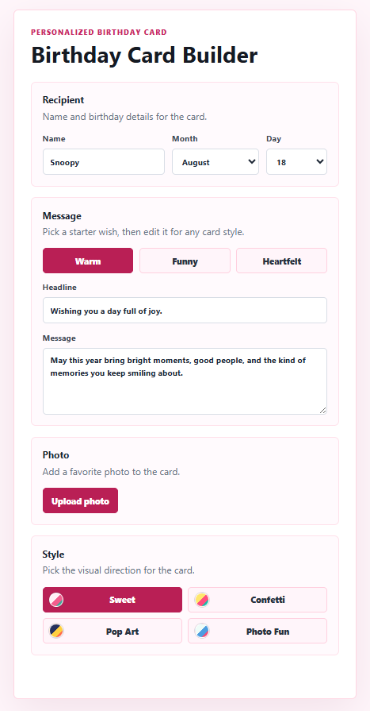
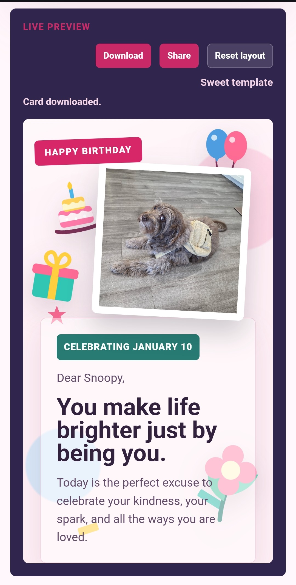
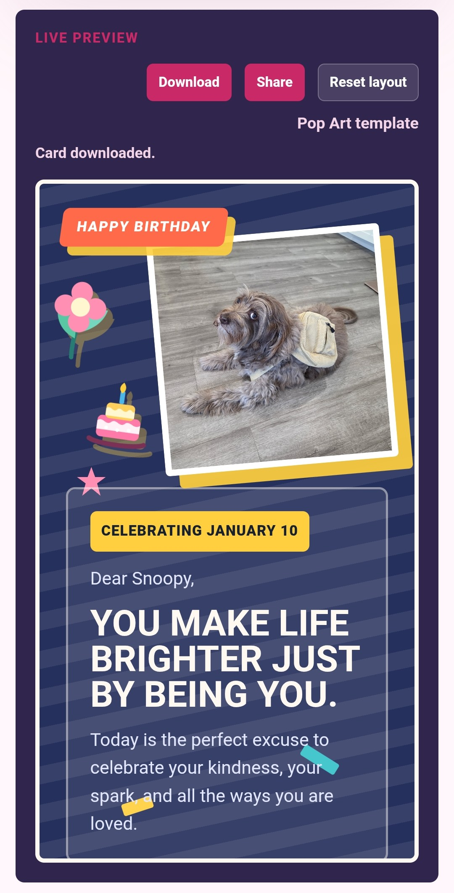
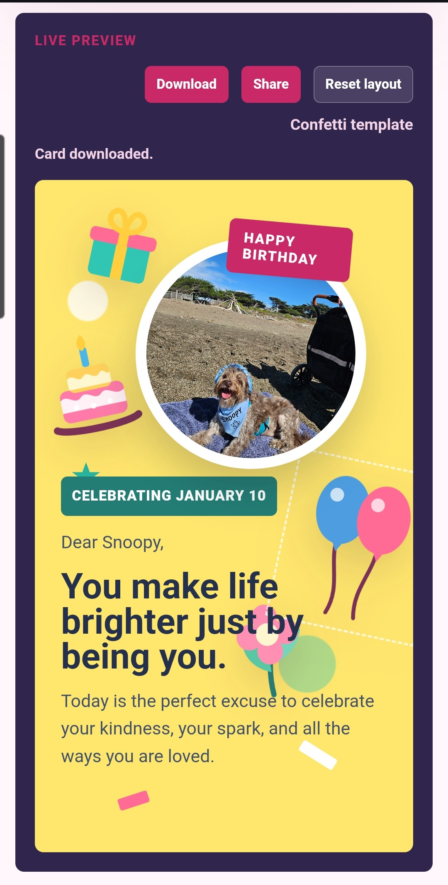

# 🎂 Personalized Birthday Card

Create customized digital birthday cards with photos, stickers, themes, and personalized messages.

**Live Demo:** https://personalized-birthday-card.vercel.app/

## 📸 Screenshots

### Card Editor

  

### Birthday Card Preview

  
  
  

## 📖 About

Personalized Birthday Card is a web application that allows users to design and customize a unique birthday card for friends and family. Users can upload photos, personalize messages, choose from multiple card styles, arrange decorative elements, and export or share their finished creation.

This project combines creativity, design, and web development to create a fun and interactive user experience.

---

## ✨ Features

### 🎉 Personalize Your Card

- Enter recipient information
- Select a pre-written birthday message template
- Edit and customize the message to make it personal

### 📸 Upload Photos

- Add your own photos to the card
- Resize and reposition photos within the design

### 🎨 Multiple Card Styles

Choose from four unique themes:

- **Sweet** – Soft colors and heartfelt birthday vibes
- **Confetti** – Fun celebration theme with festive decorations
- **Pop Art** – Bold colors and playful comic-inspired visuals
- **Photo Fun** – Designed to showcase memorable photos

### 🎈 Interactive Customization

- Drag and move photos around the card
- Reposition decorative stickers
- Experiment with different layouts and designs

### 📤 Export & Share

- Download the finished birthday card as an image
- Share your personalized creation with friends and family

---

## 🚀 How to Use

1. Open the application.
2. Enter the recipient's name.
3. Select a birthday message template.
4. Edit the message if desired.
5. Upload one or more photos.
6. Choose a card style:
   - Sweet
   - Confetti
   - Pop Art
   - Photo Fun

7. Drag photos and stickers into your preferred positions.
8. Preview your final design.
9. Download or share the completed birthday card.

---

## 🛠️ Built With

- React
- TypeScript
- Vite
- HTML5
- CSS3
- Vercel

---

## 📚 Development Process

I created the idea for this project and used Codex as a development assistant throughout the process.

Rather than generating an entire application from a single prompt, I planned the project feature by feature, defining requirements, evaluating implementations, and refining the user experience at each step. Every feature was developed incrementally, tested, and adjusted until it matched my vision for the product.

Through this project, I gained experience in:

- Breaking large ideas into smaller development tasks
- Prompt engineering and communicating technical requirements clearly
- Reviewing and modifying AI-generated code
- Debugging and iterative development
- React and TypeScript development
- Git and GitHub workflows
- Deploying applications with Vercel

This project taught me that successful software development involves planning, decision-making, testing, and continuous improvement—not just writing code.

---

## 🔮 Future Improvements

- Birthday music and sound effects
- Animated transitions and celebrations
- AI-generated birthday messages

---

## 👩‍💻 Author

**Ngoc Hui (Jade)**

Computer Science student passionate about software engineering, creative technology, and building engaging user experiences.
